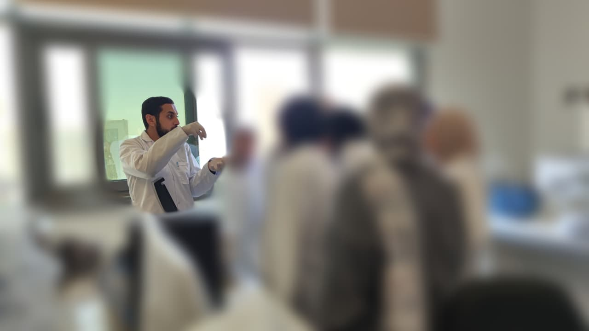

In the lab, it's more than just science — it's about nurturing curiosity and guiding every small step toward discovery.

"Every great mind was once a student guided with patience."





##### Every course I’ve explored, every workshop I’ve attended, and every conference I’ve joined has been a stepping stone in my journey of lifelong learning and scientific curiosity.

<a href="https://wa.me/201234567890" target="_blank" style="text-decoration:none;">
   WhatsApp
</a>

 

