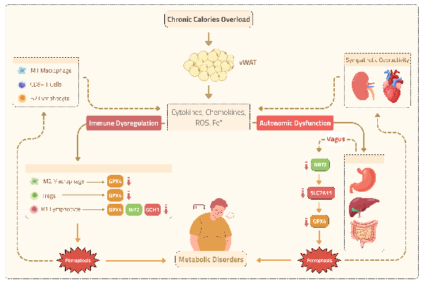
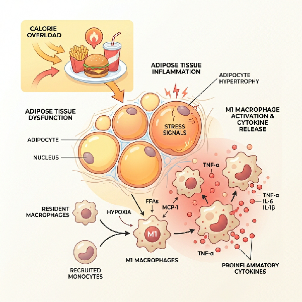
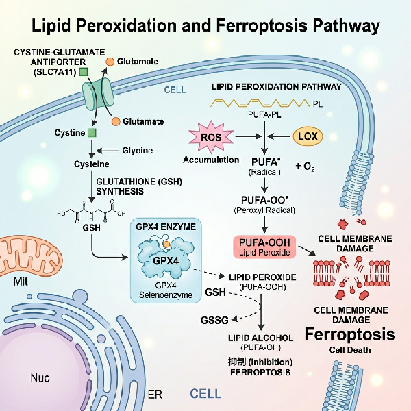



<em>Feel free to use my scientific illustartions for any academic purpose! Enjoy! 💙</em>

<!-- Block 1 -->

<svg width="15" height="15" viewBox="0 0 24 24" fill="none" stroke="currentColor" stroke-width="2.5" stroke-linecap="round" stroke-linejoin="round">
<circle cx="11" cy="11" r="8"></circle>
<line x1="21" y1="21" x2="16.65" y2="16.65"></line>
<line x1="11" y1="8" x2="11" y2="14"></line>
<line x1="8" y1="11" x2="14" y2="11"></line>
</svg>
Preview

FIG 01
Sept 2025

<h3 class="sci-card-title">Metabolic Disorders, Autonomic Immune Dysfunction, and Ferroptosis</h3>

Integrative molecular signaling map illustrating how chronic nutrient overload, visceral white adipose tissue (vWAT) inflammation, and autonomic nerve impairment interact to drive iron-dependent ferroptosis across metabolic organs.

Ferroptosis
Metabolic Disorders
Illustrations

<button class="sci-preview-btn" onclick="openSciModal(0); event.stopPropagation();" aria-label="Preview Metabolic Disorders illustration">
<svg width="15" height="15" viewBox="0 0 24 24" fill="none" stroke="currentColor" stroke-width="2.5" stroke-linecap="round" stroke-linejoin="round">
<circle cx="11" cy="11" r="8"></circle>
<line x1="21" y1="21" x2="16.65" y2="16.65"></line>
<line x1="11" y1="8" x2="11" y2="14"></line>
<line x1="8" y1="11" x2="14" y2="11"></line>
</svg>
Preview
</button>

<!-- Block 2 -->

<svg width="15" height="15" viewBox="0 0 24 24" fill="none" stroke="currentColor" stroke-width="2.5" stroke-linecap="round" stroke-linejoin="round">
<circle cx="11" cy="11" r="8"></circle>
<line x1="21" y1="21" x2="16.65" y2="16.65"></line>
<line x1="11" y1="8" x2="11" y2="14"></line>
<line x1="8" y1="11" x2="14" y2="11"></line>
</svg>
Preview

FIG 02
Aug 2025

<h3 class="sci-card-title">Visceral Adipose Tissue (vWAT) Inflammation</h3>

Pro-inflammatory signaling dynamics within visceral white adipose tissue during chronic nutrient surplus, featuring M1 macrophage activation, CD8+ T-cell infiltration, and cytokine secretion cascades.

Adipose
Inflammation
Illustrations

<button class="sci-preview-btn" onclick="openSciModal(1); event.stopPropagation();" aria-label="Preview Visceral Adipose Tissue illustration">
<svg width="15" height="15" viewBox="0 0 24 24" fill="none" stroke="currentColor" stroke-width="2.5" stroke-linecap="round" stroke-linejoin="round">
<circle cx="11" cy="11" r="8"></circle>
<line x1="21" y1="21" x2="16.65" y2="16.65"></line>
<line x1="11" y1="8" x2="11" y2="14"></line>
<line x1="8" y1="11" x2="14" y2="11"></line>
</svg>
Preview
</button>

<!-- Block 3 -->

<svg width="15" height="15" viewBox="0 0 24 24" fill="none" stroke="currentColor" stroke-width="2.5" stroke-linecap="round" stroke-linejoin="round">
<circle cx="11" cy="11" r="8"></circle>
<line x1="21" y1="21" x2="16.65" y2="16.65"></line>
<line x1="11" y1="8" x2="11" y2="14"></line>
<line x1="8" y1="11" x2="14" y2="11"></line>
</svg>
Preview

FIG 03
July 2025

<h3 class="sci-card-title">SLC7A11 / GPX4 Lipid Peroxidation Axis</h3>

Detailed cellular pathway of antioxidant breakdown, Nrf2/SLC7A11 suppression, and glutathione peroxidase 4 (GPX4) depletion leading to toxic lipid peroxidation.

Lipid Peroxidation
GPX4
Illustrations

<button class="sci-preview-btn" onclick="openSciModal(2); event.stopPropagation();" aria-label="Preview SLC7A11 GPX4 illustration">
<svg width="15" height="15" viewBox="0 0 24 24" fill="none" stroke="currentColor" stroke-width="2.5" stroke-linecap="round" stroke-linejoin="round">
<circle cx="11" cy="11" r="8"></circle>
<line x1="21" y1="21" x2="16.65" y2="16.65"></line>
<line x1="11" y1="8" x2="11" y2="14"></line>
<line x1="8" y1="11" x2="14" y2="11"></line>
</svg>
Preview
</button>

<!-- Lightbox Modal Popup -->

<button class="sci-modal-close" onclick="closeSciModal()" aria-label="Close modal">&times;</button>

<h2 id="sciModalTitle" class="sci-modal-title"></h2>

<a id="sciModalFullView" href="#" target="_blank" rel="noopener noreferrer" class="sci-btn sci-btn-secondary">
<svg width="16" height="16" viewBox="0 0 24 24" fill="none" stroke="currentColor" stroke-width="2" stroke-linecap="round" stroke-linejoin="round">
<path d="M18 13v6a2 2 0 0 1-2 2H5a2 2 0 0 1-2-2V8a2 2 0 0 1 2-2h6"></path>
<polyline points="15 3 21 3 21 9"></polyline>
<line x1="10" y1="14" x2="21" y2="3"></line>
</svg>
Full View
</a>
<a id="sciModalDownload" href="#" download class="sci-btn sci-btn-primary">
<svg width="16" height="16" viewBox="0 0 24 24" fill="none" stroke="currentColor" stroke-width="2" stroke-linecap="round" stroke-linejoin="round">
<path d="M21 15v4a2 2 0 0 1-2 2H5a2 2 0 0 1-2-2v-4"></path>
<polyline points="7 10 12 15 17 10"></polyline>
<line x1="12" y1="15" x2="12" y2="3"></line>
</svg>
Download
</a>



